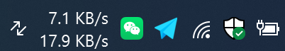
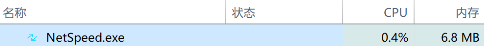

**English** | [简体中文](README.zh-CN.md)
# NetSpeed Taskbar Widget


A minimalist tool that displays **real-time network speed** (upload / download) on the **Windows taskbar**, built with `Python + PyQt6`. The visual effect is similar to `macOS iStat Menus`.

## ✨ Core Features

- Displays **download / upload** speed in real time (refreshed every second)
- Automatically embeds into the Windows taskbar, docked just to the left of the system tray
- Dark transparent background + white text, matching the taskbar style
- Right-click menu to exit
- **Single-instance** execution — launching again shows a prompt and exits
- Automatically adapts to different resolutions and scaling; supports custom size via command line
- Monitors taskbar changes (Explorer restarts, taskbar child window changes) and repositions automatically

## 🖼️ Demo

<p align="center">
  
  <br><br>
  
</p>

## 🚀 Quick Start

### 1. Clone the Project

```bash
git clone https://github.com/tokenlock/NetSpeed.git
cd NetSpeed
```

### 2. Requirements

- **Windows 10** (depends on the taskbar window structure; **Windows 11 is untested**)
- **Python 3.x**
- Windows only (depends on `win32gui` / `win32con`)

### 3. Install Dependencies

```bash
pip install -r requirements.txt
```

### 4. Run

```bash
python netspeed.py
```

## 🧩 Configuration

### Command-Line Arguments

| Argument | Short | Default | Description |
|----------|-------|---------|-------------|
| `--width` | `-w` | `148` | Widget width (px). Overrides the `WIDTH` constant in the class when provided |

Examples:

```bash
# Use the default width (148px)
python netspeed.py

# Set a custom width of 120px
python netspeed.py -w 120
python netspeed.py --width 120
```

### Class Constants

All appearance parameters are defined as constants at the top of the `NetSpeedWidget` class. Modify them and restart to apply:

| Constant | Default | Description |
|----------|---------|-------------|
| `WIDTH` | `148` | Widget width (px) |
| `HEIGHT` | `40` | Widget height (px) |
| `TEXT_WIDTH` | `55` | Width of the speed text area (px) |
| `FONT` | `"Segoe UI"` | Font |
| `FONT_SIZE` | `9` | Font size |
| `ICON_WIDTH` | `32` | Icon logical width (px) |
| `ICON_HEIGHT` | `44` | Icon logical height (px) |

> Note: `ICON_WIDTH/HEIGHT` are actually used for `scaled()`, but `setFixedSize()` uses half of them (`ICON_WIDTH//2, ICON_HEIGHT//2`). This is to accommodate `@2x` high-DPI images.

## 📦 Packaging

### 1. Install PyInstaller

```bash
pip install pyinstaller
```

### 2. Run the Build Script

```bash
build.bat
```

The script invokes `PyInstaller` with `--onefile --noconsole`, embeds the icon and the `resource` directory, and automatically cleans up the `.spec` file and the `build/` directory when done.

### 3. Output

```
dist/NetSpeed.exe
```

Double-click `dist/NetSpeed.exe` to run. You can also launch it from the command line with the `-w` argument to customize the width.

### 4. Optional: Auto-Start on Boot (Windows)

1. Press `Win + R`, type `shell:startup`, and press Enter
2. Place a shortcut to `dist/NetSpeed.exe` in the folder that opens
3. Right-click the shortcut → Properties, and append the argument (e.g. `-w 120`) to the end of the "Target" field to adapt to different resolutions

## ⌨️ How It Works

1. **Find the taskbar**
   `FindWindow("Shell_TrayWnd")` → recursively find `ReBarWindow32` → `MSTaskSwWClass`, as well as `TrayNotifyWnd`

2. **Modify window styles**
   Remove top-level window styles like `WS_POPUP`, add `WS_CHILD`, so it can act as a child window

3. **Set the parent window**
   `SetParent(hwnd, taskrebar)` — attach the Qt window under the taskbar's ReBar

4. **Dynamic positioning**
   - Calculate the screen coordinates where the widget should appear, to the left of the system tray;
   - Simultaneously shift the **right edge of `MSTaskSwWClass`** (task button area) left by `WIDTH` to make room for the widget;
   - Use `SetWindowPos` to place the widget at that position

5. **Event-driven monitoring**
   Use `SetWinEventHook` to listen for system window events (`EVENT_OBJECT_LOCATIONCHANGE` / `CREATE` / `DESTROY` / `HIDE`). The event callback forwards to the Qt signal `win_event`, and the slot `on_win_event` performs only lightweight filtering:
   - If the event belongs to a recorded taskbar-family HWND and is a position change → call `reposition_widget()` directly;
   - If it is the creation/destruction of an unknown HWND → call `_revalidate_taskbar()` to re-find `Shell_TrayWnd`, handling Explorer restarts or child window rebuilds;
   - A **1-second low-frequency fallback timer** `_fallback_tick()` covers the startup phase (when the taskbar is not yet ready) and extreme race conditions, avoiding missed events from purely event-driven logic

6. **Re-entrancy prevention**
   `reposition_widget()` uses the `_in_reposition` flag to avoid recursion caused by `MoveWindow(taskbar_view)` itself triggering `LOCATIONCHANGE`

7. **Restore on exit**
   In `closeEvent`, unhook the WinEvent hook, stop the timers, and add `WIDTH` back to the task button area width, restoring the taskbar to its original state

## 📁 Directory Structure

```
netspeed/
├── netspeed.py            # Main program
├── requirements.txt
├── README.md
├── build.bat              # Packaging exe
└── resource/
    └── netspeed@2x.png    # Icon
```

## 📄 License

MIT License